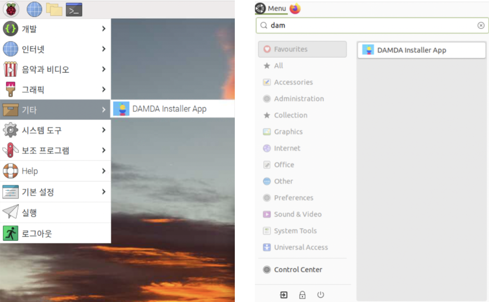

# Step1. 개발환경 구성

## Setup Environment <a href="#setup-environment" id="setup-environment"></a>

### Step1: Prerequisites

* DAMDA 계정
  * DAMDA 환경을 구성하기 위해 DAMDA 계정이 필요합니다.&#x20;
  * DAMDA 계정이 없는 경우, [DAMDA Console](http://damda.lge.com/login?redirect=%2Fhome) 로 이동하여 [계정 생성](../fundamentals/damda-cloud/undefined/undefined.md)합니다.
* RaspberryPi 4 준비
  * RaspberryPi에 OS를 설치해서 사용할 준비를 합니다.&#x20;
  * 지원 OS는 **RaspberryPi OS(권장)**, Ubuntu mate 입니다.&#x20;
    * Raspberry Pi OS 공식 페이지: [https://www.raspberrypi.com/software/](https://www.raspberrypi.com/software/)
    * &#x20;Ubuntu MATE for Raspberry Pi 공식 페이지: [https://ubuntu-mate.org/raspberry-pi/](https://ubuntu-mate.org/raspberry-pi/)

### Step2: Install the library

필수 패키지 들을 설치합니다.

```shell
sudo apt install -y default-jdk unzip curl python3-pip libatlas-base-dev proj-bin proj-data libproj-dev libgeos-dev libgdal-dev python3-virtualenv docker.io docker-compose npm nodejs
```

### Step3: Download Installer

Installer setup 파일을 다운 받습니다.


현재 설치파일은 공개 되어 있지 않습니다. \
막바지 준비를 마치고, 해커톤 시작(11/02) 전에 공개 예정입니다!


Installer setup 파일:&#x20;

* Raspberry Pi OS: damda-installer\_1.0.3-1\_pi.deb
* Ubutu: damda-installer\_1.0.3-1\_ubuntu.deb


```shell
curl -O https://damda-component-artifacts.s3.ap-northeast-2.amazonaws.com/installer/1.0.3/damda-installer_1.0.3-1_pi.deb
```



```shell
curl -O https://damda.s3.ap-northeast-2.amazonaws.com/installer/damda-installer_1.0.3-1_ubuntu.deb
```


## Setup Installer



* DAMDA 사용자들만 installer 패키지를 받을 수 있습니다. 명령어 입력 후, 잠시 기다리면 DAMDA 계정을 입력하도록 메세지가 나옵니다.&#x20;
* DAMDA 계정을 입력할 때 까지 설치가 진행되지 않습니다.&#x20;
* DAMDA 계정 입력이 잘못 된 경우 설치가 종료 되므로, 다시 설치 명령어를 입력해주시기 바랍니다.


```shell
sudo apt install ./damda-installer_1.0.3-1_pi.deb
```



```shell
...
DAMDA ID: XXXX@lge.com
DAMDA PW:
...
Progress: [ 20%] [####################################................................................................................................................................................]
```



&#x20;Ubuntu에서는 설치 파일명에 맞춰 아래 명령어를 사용합니다


```shell
sudo apt install ./damda-installer_1.0.3-1_ubuntu.deb
```




설치 후, 아래와 같이 커널 업그레이드 안내가 나오는 경우가 있습니다.\
확인하고 계속 진행해주세요\





damda version 확인을 통해 installer 설치가 완료 되었는지 확인할 수 있습니다.

```shell
sudo damda --version
```


설치가 완료되면 아래와 같이 버전명을 확인할 수 있습니다.

```
DAMDA Installer CLI Version: 1.0.3
```



## Install DAMDA



1.  DAMDA Installer 아이콘을 눌러서 실행합니다.&#x20;

    <figure><figcaption><p>RaspberryPi OS / Ubuntu mate</p></figcaption></figure>


2.  DAMDA 계정과 디바이스를 연동하기위하여 DAMDA계정으로 로그인을 진행합니다.\
    Installer에 DAMDA id와 password 입력합니다.&#x20;

    <figure><figcaption><p>Installer 로그인 창</p></figcaption></figure>
3.  "Install" 버튼 클릭합니다.&#x20;

    <figure><figcaption></figcaption></figure>
4.  설치가 완료되면 "Next" 버튼을 눌러 다음단계로 이동합니다. \
    (설치 과정은 약 10분 정도 소요됩니다. 네트워크 환경에 따라 더 오래 소요될 수 있습니다.)

    <figure><figcaption><p>설치 진행 중</p></figcaption></figure>

    <figure><figcaption><p>설치 완료 상태</p></figcaption></figure>
5.  설치 과정이 완료 된 것을 확인합니다. \
    앞으로 컴포넌트 배포할 때 필요한 정보인, DAMDA 기기명을 확인할 수 있습니다.

    <figure><figcaption><p>설치 완료 확인</p></figcaption></figure>
6.  설치 완료 화면에서 ID 확인을 못한 경우 Installer를 다시 실행해서 확인할 수도 있습니다.

    <figure><figcaption><p>Installer 첫화면에서 기기명 확인</p></figcaption></figure>
7.  [DAMDA Console](http://damda.lge.com/)의 디바이스 탭에서 동일한 디바이스 ID로 기기가 생성된 것을 확인할 수 있습니다.

    <figure><figcaption><p>DAMDA Console 디바이스 탭에서 기기명 확인</p></figcaption></figure>
8. 이제 라즈베리파이가 DAMDA 디바이스가 되었습니다. 컴포넌트를 배포할 수 있는 준비가 완료되었습니다!



damda install 명령을 sudo 로 실행합니다

```shell
sudo damda install
```


DAMDA 계정과 디바이스를 연동하기위하여 DAMDA계정으로 로그인을 진행합니다.\
DAMDA id와 password 입력합니다.

```shell
DAMDA ID: XXXX@lge.com
DAMDA PW:
Installing  [####################################]  100%
Device ID: Damda-V2-XXXXXXXXXX
```


설치 완료 후, damda info 명령을 통해 기기가 생성된 것을 확인할 수 있습니다.

```shell
$ sudo damda info
DAMDA Device ID: Damda-V2-ZAhi2pjmSpatGd4ITFl5zA
```


[damda console](http://damda.lge.com/home)에도 디바이스가 만들어 진 것을 확인할 수 있습니다

<figure><figcaption></figcaption></figure>




'메뉴 > 기타'에서 DAMDA Home앱이 설치된 것을 확인할 수 있습니다. [DAMDA Home앱](../fundamentals/damda/damda-home.md)에서는 설치된 컴포넌트 리스트 확인 등 다양한 기능을 사용할 수 있습니다.&#x20;

