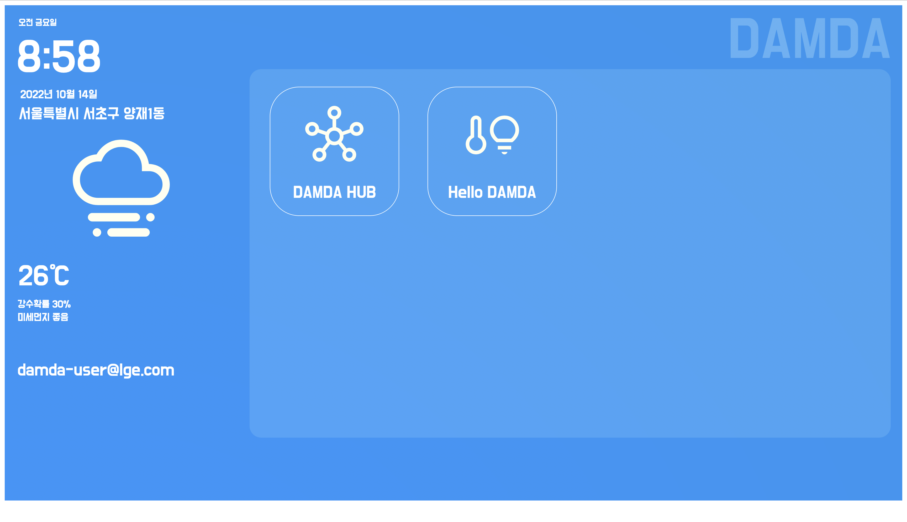

# Step2. Hello DAMDA 따라하기

## 1. "Hello DAMDA" 작성하기&#x20;

index.html 파일명으로 아래 코드를 작성해주세요.

```html
<!-- index.html (Hello, Damda) Sample Code -->
<html>
    <body>
        Hello! Damda!!
    </body>
</html>
```

## 2. zip파일로 압축하기

생성된 index.html 파일을 zip 형태로 압축을 합니다. (파일명 상관없음)

<figure><figcaption><p>MAC에서 index.html 압축하</p></figcaption></figure>

## 3. zip파일을 DAMDA콘솔에 업로드

1. DAMDA Console([http://damda.lge.com](http://damda.lge.com))에 접속하고 본인의 계정을 이용하여 로그인을 합니다.&#x20;

<figure><figcaption><p>[DAMDA Console] Login 화면</p></figcaption></figure>

2\. 좌측 메뉴의 '**컴포넌트**'를 선택하여 컴포넌트 화면으로 진입합니다.&#x20;

<figure><figcaption><p>[DAMDA Console] 컴포넌트</p></figcaption></figure>

3\. '**컴포넌트 생성**' 버튼을 클릭하면 컴포넌트 생성 팝업이 나타납니다.&#x20;

<figure><figcaption><p>[DAMDA Console] 컴포넌트 생성</p></figcaption></figure>

4\. **컴포넌트명**과 **설명**을 입하고 '**다음**' 버튼을 클릭하여 컴포넌트 추가 설정 화면으로 이동합니다.&#x20;

<figure><figcaption><p>[DAMDA Console] 컴포넌트 생성 - 추가설</p></figcaption></figure>

5\. '**코드**' 항목의 '**추가**' 버튼을 이용하여 2단계에서 생성된 zip 파일을 추가한 뒤 '**저장**' 버튼을 통해 컴포넌트를 저장합니다.

6\. 저장이 완료되면 '**내 컴포넌트'**에 새로운 컴포넌트가 추가된 것을 확인할 수 있습니다.&#x20;

<figure><figcaption><p>[DAMDA Console] 컴포넌트 화면 - 컴포넌트 추가시</p></figcaption></figure>

## 4. DAMDA콘솔에서 배포

1.업로드 된 컴포넌트의 좌측에 표시되는 **선택박스**를 선택한 뒤 오른쪽 하단의 '**배포하기**' 버튼을 클릭합니다.

<figure><figcaption></figcaption></figure>

2\. 내 컴포넌트(`com.damda.sample.hellodamda`)와 웹서버 퍼블릭 컴포넌트(`com.damda.webserver`)만 남겨두고 나머지는 모두 **제외** 버튼을 통해 삭제합니다. _(_※ _퍼블릭 컴포넌트는 자동으로 추가되기 때문에 불필요한 컴포넌트는 배포 내용에서 제외합니다)_

3\. 화면 하단 **배포 대상**에 배포할 대상 **DAMDA 기기**를 선택합니다. (※ _DAMDA 기기의 정보는 '**디바이스**' 탭을 통해 확인 가능합니다_)

<figure><figcaption></figcaption></figure>

4\. '배포 요청' 버튼을 클릭하면 배포가 시작되고 배포 과정이 화면 하단에 표시됩니다.

<figure><figcaption></figcaption></figure>

5\. '배포 완료' 표시를 통해 컴포넌트의 배포가 완료된 것을 확인할 수 있습니다. &#x20;

## 5. 배포된 컴포넌트 확인

#### 1) DAMDA Console에서 확인하기

DAMDA Console  **'디바이스'** 화면에서 배포된 기기를 선택(_'**Details**' 누름_)하면 오른쪽 하단에 컴포넌트 상태를 확인할 수 있습니다. \
**내 컴포넌트(**_**`com.damda.sample.hellodamda`**_**)**의 상태가 "**FINISHED**" 이고, **웹 서버 퍼블릭 컴포넌트 (**_**`com.damda.webserver`**_**)**의 상태가 "**RUNNING**" 이면 정상적으로 배포된 상태입니다.&#x20;

<figure><figcaption></figcaption></figure>

#### 2) DAMDA 기기 (DAMDA Home)에서 확인하기

DAMDA 기기 내 [DAMDA Home](../fundamentals/damda/damda-home.md)을 실행하면 내가 새로 설치한 컴포넌트가 화면에 나타나는 것을 확인할 수 있습니다. \
내가 설치한 컴포넌트의 Icon을 선택(더블클릭)하면 브라우져를 통하여 해당 컴포넌트의 화면(index.html)의 화면을 확인할 수 있습니다.&#x20;

<figure><figcaption><p>DAMDA HOME 화</p></figcaption></figure>

#### 3) 개발 PC에서 확인하기

개발 PC의 브라우저를 통해 샘플 컴포넌트의 화면을 확인할 수 있습니다. \
브라우저의 주소창에 `http://<damda device ip>:30001/<component_id>/<component version>/<압축파일명>/index.html` 을 입력하면 해당 앱포넌트 화면을 확인할 수 있습니다.&#x20;

```
ex) http://192.168.50.25:30001/com.damda.sample.hellodamda/1.0.0/hellodamda/index.html
```

<figure><figcaption></figcaption></figure>
